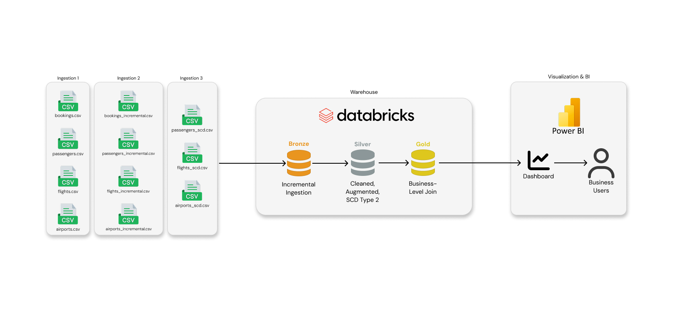
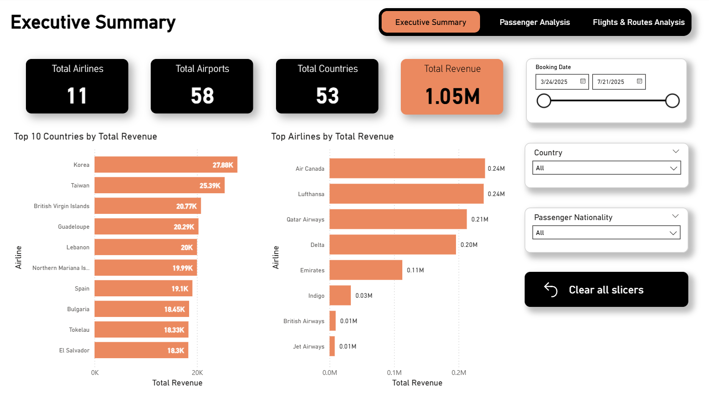
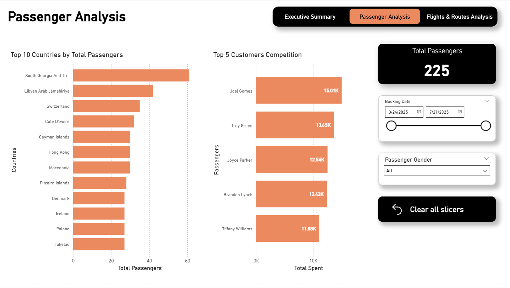
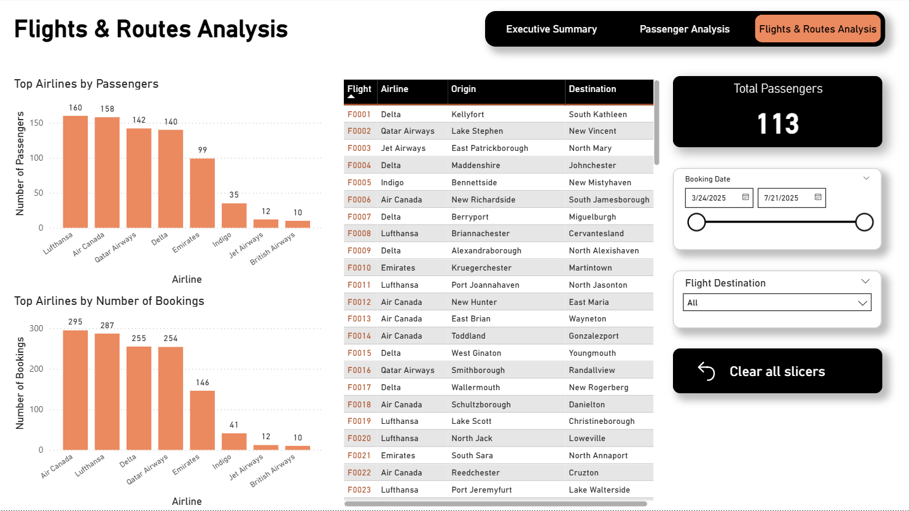

# Databricks Flights End-to-End Project

This project demonstrates a data engineering pipeline built within Databricks. It implements a Medallion Architecture to process flight and passenger data, transforming raw CSV files into a star schema optimized for business intelligence. The primary goal of this repository is to showcase proficiency in Databricks-native and concepts.

## Project Overview

The objective of this project was to design and implement a scalable ETL pipeline that handles data ingestion, quality enforcement, and dimensional modeling. The pipeline ensures data integrity through schema evolution and provides a clean, gold-layer star schema for downstream analytics in Power BI.
```
.
├── bronze_layer.ipynb
├── exploration.ipynb
├── gold_layer.ipynb
├── parameters.ipynb
├── setup.ipynb
├── jobs/
├── silver_layer/
├── assets/
└── dashboard/
```
### Architecture and Data Flow



The project follows the Medallion Architecture, ensuring data progressively increases in quality and structure as it moves through the layers:

**Raw Layer:** Data is stored in Databricks Volumes (raw/raw_volume) as a collection of CSV files containing booking facts and passenger, flight, and airport dimensions.

**Bronze Layer (Ingestion):** I wrote an Autoloader for incremental loading, schema-inferring ingestion, into Delta Tables. This stage ensures that new files arriving in the volume are processed efficiently without re-processing old data.

```
bronze_layer.ipynb
parameters.ipynb
```

**Silver Layer (Transformation):** Implements Lakeview declarative piples for pipeline management. This layer handles data cleansing, type control, and surrogate key generation for each dimension, and the implementation of Slowly Changing Dimensions for historical tracking.

```
silver_layer/
└── transformations/
    ├── airports_cleaning.py
    ├── bookings_cleaning.py
    ├── flights_cleaning.py
    └── passengers_cleaning.py
```

**Gold Layer (Analytics):** Finalizes the Star Schema. It consists of a central fact_bookings table surrounded by optimized dimensions and a consolidated business join table for simplified reporting.

```
gold_layer.ipynb
```

### Tech Stack

**Platform:** Databricks (Unity Catalog, Workflows)

**Languages:** PySpark, SQL

**Storage:** Delta Tables (Databricks)

**Ingestion:** Autoloader (Cloud Files)

**Transformation:** PySpark & Declarative Pipelines

**Orchestration:** Databricks Jobs

**Visualization:** Power BI

### Data Schema

The pipeline processes four primary datasets to provide a view of flight operations:

fact_bookings: `booking_id`, `passenger_id`, `flight_id`, `airport_id`, `amount`, `booking_date`

dim_passengers: `passenger_id`, `name`, `gender`, `nationality`

dim_flights: `flight_id`, `airline`, `origin`, `destination`, `flight_date`

dim_airports: `airport_id`, `airport_name`, `city`, `country`

### Pipeline Automation

The entire workflow is orchestrated using Databricks Jobs. The automation sequence is defined as follows:

Bronze Task: Triggers the Autoloader ingestion job to capture new raw files.

Silver Task: Executes the ETL pipeline for different operations.

Full Pipeline Job: Executes each layer's task sequencially.

```
jobs/
├── bronze_ingestion_job.yaml
├── bronze_layer_task.ipynb
├── parameter_task.ipynb
└── full_medallion_pipeline.yaml
```

### Business Intelligence

```
dasboard/
└── Flight Visualisations.pbix
```

The finalized Gold layer is connected to Power BI via a Databricks SQL Warehouse connection. The resulting dashboard provides actionable insights through three specialized views:

**Executive Summary:** High-level KPIs regarding total bookings and revenue.



**Passenger Analysis:** Demographic breakdowns and nationality-based trends.



**Flights & Routes Analysis:** Performance metrics for airlines and geographical route popularity.

